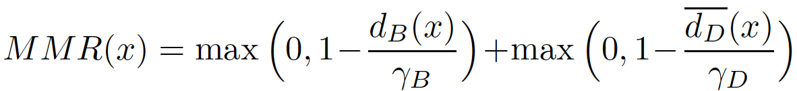
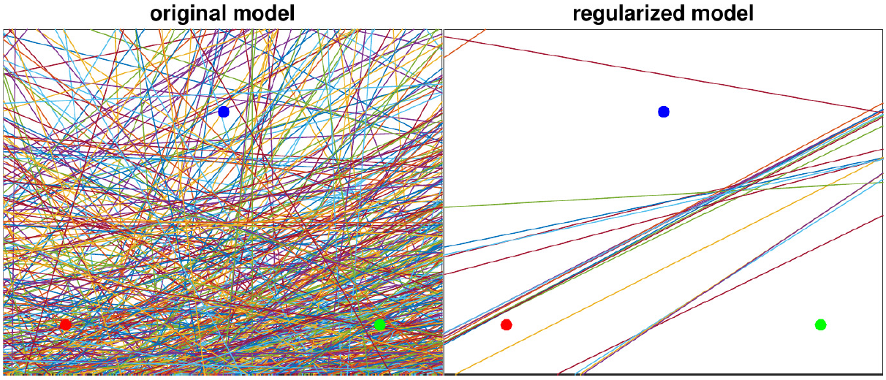
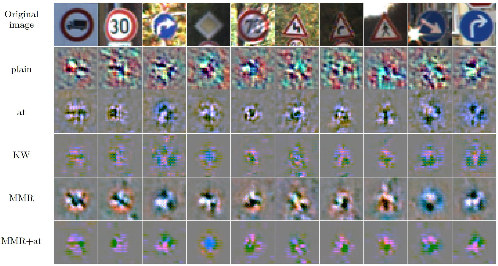
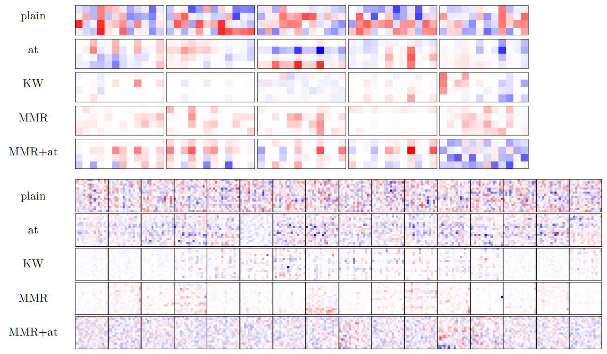
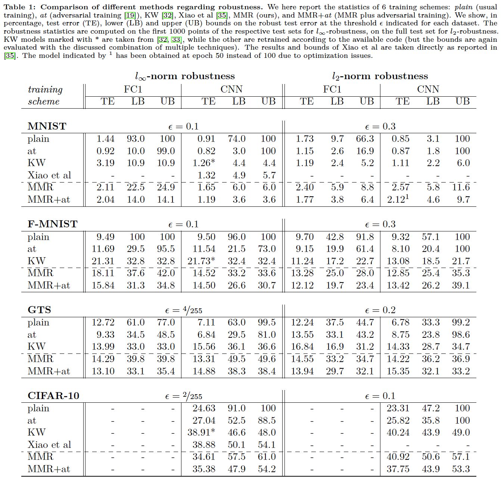

# [Provable Robustness of ReLU networks via Maximization of Linear Regions](https://arxiv.org/abs/1810.07481) 
**AISTATS 2019**

**Francesco Croce\*, Maksym Andriushchenko\*, Matthias Hein**

**University of Tübingen and Saarland University**

**Update**: Now all the models and datasets are hosted on [Google Drive](https://drive.google.com/drive/folders/1f_Qf1abFXZw1GgWxttO9tgek6M7_lYiZ).

## Main idea
We introduce the *Maximum Margin Regularizer* (MMR), which expands the linear regions of ReLU-networks 
and pushes the decision boundaries away from data points:
<!--- (up to γ_B and γ_D which roughly correspond to the radius of the Lp ball defined by the threat model) 
--->

<!---  --->


Training with MMR leads to models which are provably robust according to the current 
state-of-the-art certification methods based on [Mixed Integer Programming](https://arxiv.org/abs/1711.07356)
or its [LP-relaxations](https://arxiv.org/abs/1711.00851). 

To illustrate the effect of MMR, we show the linear regions of a ReLU-network on a 2D
subspace spanned by three random points from different classes
of MNIST. We observe a clear maximization of the
linear regions for the MMR-regularized case (right) versus the
non-regularized case (left). This is exactly what helps the certification 
(for details, see the paper).



Inspired by the observation of [Tsipras et al, 2019](https://arxiv.org/abs/1805.12152),
we also illustrate how the gradient of the loss wrt inputs is affected by MMR. We see that 
it highlights more semantically meaningful features (i.e. the traffic sign, and not the background).
Therefore, it's not only a consequence of adversarial training, but potentially of all methods
that truly increase robustness of classifiers. 



We also find that provably robust models wrt Linf-norm (our MMR and 
[KW training](https://arxiv.org/abs/1711.00851)) lead
to very sparse convolutional filters.
Note that adversarial training of [Madry et al, 2018](https://arxiv.org/abs/1706.06083) does not
have the same level of sparsity.
Below are the filters from the 1st and 2nd layers:



## Results and models

We present our extensive experimental results in the following table:



You can find all the models presented in this table in the folder `models` (can be downloaded from [here](https://drive.google.com/drive/folders/1f_Qf1abFXZw1GgWxttO9tgek6M7_lYiZ)). 
The subfolders correspond to the training scheme (plain, adversarial training, Kolter and Wong, 
MMR, MMR with adversarial training): 
`plain`, `at`, `kw`, `mmr`, `mmr+at`.  
The file names of the models contain the hyperparameters used for their training. For example:
> `2019-02-17 01:54:16 dataset=mnist nn_type=cnn_lenet_small p_norm=inf lmbd=0.5 gamma_rb=0.2 gamma_db=0.2 ae_frac=0.5 epoch=100.mat`

means that the model was trained on MNIST, the architecture was `cnn_lenet_small` (see `models.LeNetSmall` for its definition),
the MMR was applied wrt the Linf-norm with λ=0.5, γ_B=γ_D=0.2, with 50% of adversarial examples in every batch, and for 100 epochs in total.

The datasets used (MNIST, FMNIST, GTS, CIFAR-10) are provided also as .mat files in 
the folder `datasets` (can be downloaded from [here](https://drive.google.com/drive/folders/1f_Qf1abFXZw1GgWxttO9tgek6M7_lYiZ)).


## Training MMR models

Here are a few examples on how to train:
+ CNN model with Linf-MMR on MNIST with adversarial training:
  `python train.py --dataset=mnist --gpus 0 --lmbd=0.5 --gamma_rb=0.2 --gamma_db=0.2 --p=inf --nn_type=cnn_lenet_small --gpu_memory=0.5 --ae_frac=0.5 --exp_name=cnn_linf`

+ Fully-connected model with Linf-MMR on FMNIST with adversarial training:
  `python train.py --dataset=fmnist --gpus 0 --lmbd=1.0 --gamma_rb=0.15 --gamma_db=0.15 --p=inf --nn_type=fc1 --gpu_memory=0.3 --ae_frac=0.5 --exp_name=fc1_linf`

More details are available by `python train.py --helpfull`.

Note that the implementation of MMR as a TensorFlow computational graph can be found in `regularizers.py`.


## Evaluation

`eval.py` combines multiple methods to calculate empirical and provable robust error 
(as we report in Table 1):

+ For example, to evaluate the MMR+at CNN model on MNIST wrt Linf norm on 
  100 test examples (expected running time: 6 min):
  `python eval.py --n_test_eval=100 --p=inf --dataset=mnist --nn_type=cnn_lenet_small --model_path="models/mmr+at/2019-02-17 01:54:16 dataset=mnist nn_type=cnn_lenet_small p_norm=inf lmbd=0.5 gamma_rb=0.2 gamma_db=0.2 ae_frac=0.5 epoch=100.mat"`

+ For example, to evaluate the MMR+at FC1 model on FMNIST wrt Linf norm on
  100 test examples (expected running time: 9 min):
  `python eval.py --n_test_eval=100 --p=inf --dataset=fmnist --nn_type=fc1 --model_path="models/mmr+at/2019-02-25 15:20:35 dataset=fmnist nn_type=fc1 p_norm=inf lmbd=1.0 gamma_rb=0.15 gamma_db=0.15 ae_frac=0.5 lr=0.001 epoch=100.mat"`

The two most important numbers are the combined empirical robust error `pgd+mip lb: X%` (PGD + MIP, i.e. 
the lower bound on the worst-case robust error), 
and the combined provable robust error `kw+mip ub: Y%` (Kolter-Wong + MIP, i.e. the upper bound).

Please note that for `plain` or `at` models, certification with `MIPVerify.jl` may take quite a long time.
So for testing purposes, we recommend to evaluate it on several points, e.g. with `--n_test_eval=5`.

More details are available by `python eval.py --helpfull`.

Note, that `eval.py` does not include evaluation of the lower bounds with 
[A randomized gradient-free attack on relu networks. GCPR, 2018](https://arxiv.org/abs/1811.11493),
which is available in a [separate repository](https://github.com/jonasrauber/linear-region-attack).


## Requirements
All main requirements are collected in the Dockerfile.
The only exception is `MIPVerify.jl` and Gurobi (free academic licenses are available). 
For this, please use the 
[installation instructions](https://vtjeng.github.io/MIPVerify.jl/latest/#Installation-1)
provided by the authors of `MIPVerify.jl`. But note that Gurobi with a free academic license cannot 
be run from a docker container.

Also note that we use our own forks of `kolter_wong` ([Wong et al, 2018](https://arxiv.org/abs/1711.00851)) and 
`MIPVerify.jl` ([Tjeng et al, 2018](https://arxiv.org/abs/1711.07356)) libraries. 
And that in `attacks.py` we redefine the class `MadryEtAl` of `Cleverhans` library to support 
normalized L2 updates for the PGD attack.


## Contact
Please contact [Maksym Andriushchenko](https://github.com/max-andr) regarding this code.


## Citation
```
@article{croce2019provable,
  title={Provable Robustness of ReLU networks via Maximization of Linear Regions},
  author={Croce, Francesco and Andriushchenko, Maksym and Hein, Matthias},
  journal={AISTATS 2019},
  year={2019}
}

```
